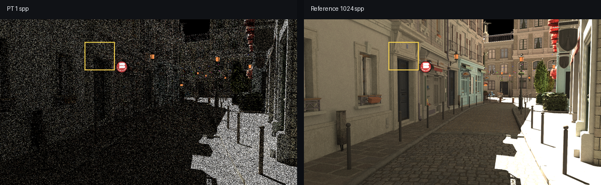
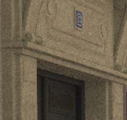
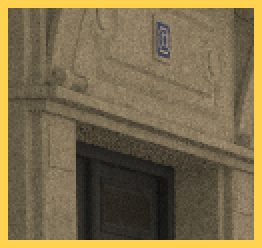

# EXR Cropper Web

[Open GitHub Pages](https://jungsikoh.github.io/exr-cropper-web/)

## Demo

The demo uses only these input files from `path-tracer-python/input_exr`:

- `bistro_pathtracer_1spp_linear.PathTracer.color.0.exr`
- `psf_bistro_fixed_reference_pt_1024spp.AccumulatePass.output.0.exr`

## Sample

| PT 1 spp crop | Reference crop | Reference overlay |
| --- | --- | --- |
|  |  |  |

## Usage

1. Open the GitHub Pages link.
2. Click `Add EXR` and select the EXR files to compare.
3. Select the reference file and click `Set Ref`.
4. Add a crop box with `Add Box`, or drag directly on the preview.
5. Adjust `X`, `Y`, `Width`, `Height`, `Line Width`, `Box Color`, and `Exposure` as needed.
6. Click `Export Crops` to download `exr-crops.zip`.

## Quality

The exported `.exr` crop was checked against a Python OpenEXR crop from the PT 1 spp sample. `R`, `G`, and `B` were bit-exact with `max_abs=0.0`, so there was no quality or value loss in the EXR output.

Use the exported `.exr` files for evaluation. The `.png` files are tonemapped preview images for viewing and figures.
